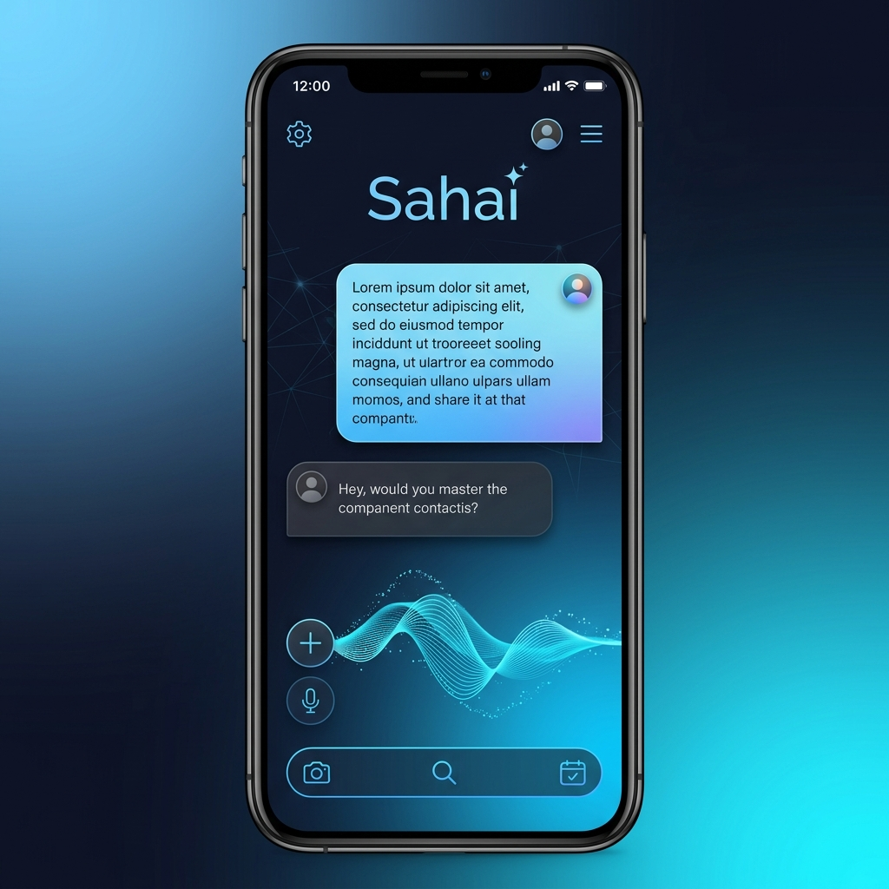

<div align="center">
  
  <h1>Sahai</h1>
  <p><strong>The Multimodal AI Copilot for Your Life and Meetings</strong></p>

  [](https://expo.dev/)
  [](https://reactnative.dev/)
  [](https://www.typescriptlang.org/)
  [](https://opensource.org/licenses/MIT)
</div>

---

## 🌟 Overview

**Sahai** is a sophisticated, production-grade mobile application that redefines the concept of an AI assistant. Built on a foundation of **React Native** and **Expo**, Sahai integrates state-of-the-art Large Language Models (LLMs) with advanced local processing to provide a private, fast, and multimodal experience.

Whether you're in a high-stakes meeting, analyzing complex documents, or needing instant visual context from your camera, Sahai acts as your invisible co-pilot—always listening, always ready.

---

## 🚀 Key Features

### 🎙️ Intelligence-Driven Meeting Engine
Transform how you participate in meetings. Sahai doesn't just record; it understands.
- **Real-time Question Detection:** Uses advanced NLP to detect questions directed at you or the group.
- **Autonomous Answering:** Generates context-aware answers to detected questions in the background.
- **Live Diarization:** (Planned) Persistent voice enrollment for personalized speaker filtering.

### 🧠 Advanced RAG (Retrieval-Augmented Generation)
Your documents, now searchable and conversational.
- **Massive Context Support:** Upload and index up to 50 documents (PDFs, TXT, Code files).
- **On-Device Vector-ish Engine:** Uses a custom BM25 scoring algorithm for lightning-fast, offline-first context retrieval.
- **Privacy First:** Your data is indexed and queried locally before being sent as relevant context to the AI.

### 🎥 Vision & Multimodal Capabilities
See the world through the eyes of AI.
- **AI Camera:** Real-time analysis of visual data using Llama Vision APIs.
- **Video Intelligence:** Extracts key frames for temporal analysis of events or demonstrations.
- **All-in-One Chat:** A unified interface for Text, Audio, Video, and Image inputs.

### ⚡ Performance & Reliability
- **Smart Caching:** Sophisticated memory management for document chunks and image assets.
- **Offline-First Resilience:** Core search and indexing functions work without an internet connection.
- **Haptic UI:** Deeply integrated haptic feedback for a premium native feel.

---

## 🛠️ Technology Stack

| Layer | Technologies |
| :--- | :--- |
| **Frontend** | React Native, Expo Router, Reanimated, Expo Blur, Expo Haptics |
| **AI Models** | Groq (Llama 3.3 / Llama 3.2 Vision), Google Gemini 2.0 Flash |
| **Services** | Whisper (Speech-to-Text), Groq Audio, Custom Question Detection |
| **Data Engine** | Local File System (Expo FS), BM25 Retrieval, Persistent JSON Storage |
| **Language** | TypeScript (Strict Mode) |

---

## 🏗️ Technical Architecture

Sahai is designed with a service-oriented architecture to ensure modularity and speed:

1.  **RagContextStore:** Handles the chunking, indexing, and persistent storage of user documents.
2.  **QuestionDetector:** A dedicated service that monitors transcription streams for specific intent.
3.  **ChatSessionStore:** Manages complex multi-modal conversation histories and context injection.
4.  **Vision Engine:** Optimized frame-extraction pipeline for video-to-AI analysis.

---

## 📦 Getting Started

### Prerequisites
- Node.js (v18+)
- npm or bun
- Expo Go app on your mobile device or an Emulator

### Installation

1. **Clone the repository:**
   ```bash
   git clone https://github.com/yourusername/sahai.git
   cd sahai
   ```

2. **Install dependencies:**
   ```bash
   npm install
   ```

3. **Configure Environment Variables:**
   Create a `.env` file in the root directory and add your API keys:
   ```env
   GROQ_API_KEY=your_groq_key_here
   GEMINI_API_KEY=your_gemini_key_here
   ```

4. **Start the development server:**
   ```bash
   npx expo start
   ```

---

## 📱 Screenshots

<div align="center">
  
  <p><i>The sleek, modern interface of Sahai.</i></p>
</div>

---

## 🤝 Contributing

We welcome contributions! Please follow these steps:
1. Fork the Project
2. Create your Feature Branch (`git checkout -b feature/AmazingFeature`)
3. Commit your Changes (`git commit -m 'Add some AmazingFeature'`)
4. Push to the Branch (`git push origin feature/AmazingFeature`)
5. Open a Pull Request
